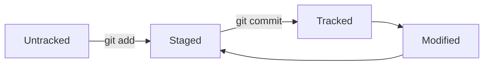

# 1.Основные команды GitBash *для начинающих*

Я здесь оставлю шпаргалку для всех интресующихся базовые команды для начинающих, позволяющих очень просто и быстро связать и синхронизировать удаленный и локальный репозитории, а также работать с фйлами и папками.

## Команды

1. cd <каталог> - команда позволяющая перемещаться по каталогам и папкам.
----
2. cd <..> - переход на директорию по иерархии выше уровня располжения папок 
----
3. pwd - просмотр текущего местоположении пути консоли
----
4. ls -a - открывает полный список всех в текущей деректории файлов(в т.ч. скрытых системой)
----
5. touch <имяфайла.расширениефайла> - создать файл с указанием имени и расширения
----
6. mkdir <имяпапки> - создать папку с указанием ее имени
----
7. cd ~ - перейти в домашнию директорию
----
8. cp <что копируем> -> <куда копировать> - копиравать файл
----
9. mv <файл для перемещение> -> <точка переноса файла перемещения> - команда переноса файла из одного места на диске в другое
----
10. rm <файл> - удалить файл. Если есть расширение, то тоже указать
----
11. rmdir <имя папки> - удалить папку
----
12. r -r - удалить папку вместе с файлами в ней 
----
13. git add <имяфайла.расширениефайла> - добавить файл в список контроля версий для изменения и сохранений версий файла
----
14. git commit <имя файла> - сохранения всех изменений файла, изменение новой обновленной версии
----
15. git remote add <имя репозитория> -> <URL - адрес репозитория> - связать удаленный и локальный репозиторий
----
16. git push -u <локальная ветка репозитория> <удаленная ветка репозитория>
----
17. cat <файл> - прочитать файл

## 2.Работа с Git.

Команды мы изучили можно приступать к следующему.  
Тут мы с вами познакомимся с основными понятиями и тонкостями, которые могут встретится при работе с Git.

## Хеш

Хеш, который мы встречаем при исполнении команды git log - это индентификатор коммита. Результат шифрования получает хеш, то есть происходит хеширование. Обычно состоит из латинских букв и цифр. В нашем случае по умолчанию используется протокол хэширования SHA-1. В нем зашиты данные содержимого репозитория и дату создания коммита. Нужно помнить, что длина не менее 40 символ хеша. Хотя хеш при выводе на интерфейс можно сократить, прописав *git log --oneline.*

## 3. Логи. Git.

Логи, или *git log* выводит полную информацию о коммите, а именно: коммит, автора, дата и сообщения коммита. Для более быстрого определения и просмотра коммита пишут *git log --oneline*. В таком случае будет хэш коммита и его сообщение в одну строчку

## 4. Всему голова - служебный файл.

Речь пойдет об одном служебном файле в *.git/* . *Это файл HEAD.* Этот файл хранит ссылку на последний коммит, а точнее его хеш.

## 5. Статусы файлов. Git.
Статусы файлов в Git нужны для внимательного и граммотного контроля версий файла и его изменений. Вот примеры статусов:
  1.Untracked
  2.Staged
  3.Tracked
  4.Modified
Untracked - данные существуют, но гит их не фиксирует и не вносить в список для последущих изменений или коммита. Обычные такие данные это новые файлы.
Staged - данные внесены в список для последующей обработки и изменений. Здесь мы говорим *Git'у* "зафиксируй и запомни этот файл либо информацию для следующего коммита".
Tracked - в эту область попадают файлы, которые уже были зафиксированы с помощью *git commit*, а так же файлы, которые недавно были добавлены в staging area(список, каталог) git add'ом. Так или иначе в обоих этих случаях файлы помечены и фиксируются Git'ом.
Modified - статус, который ссылается, что на определенном этапе при работе с файлом была изменена его структура или версия. Например, файл был закоммичен, а потом изменен по сравнению с последней версии файла.

Может покзаться, что весь цикл нормирования файлов по статусу происходит хаотично, но у статусов есть свой процедурный алгоритм, по которому происходит работа с проектом и последующим файлами.
Вот следующая схема, которая это наглядно отображает:

